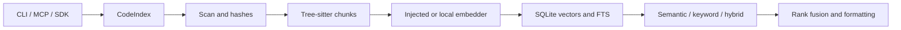

# Codemogger source overview

Source reference: commit `4abd2820787f074e9d461d22e954b92a552b968a`. The diagram and links describe this revision; they are navigation rather than runtime qualification.

Codemogger is a headless code indexing/search library with an SDK, CLI and stdio MCP surface. `CodeIndex` coordinates scanning, hashing, tree-sitter chunk extraction, embeddings and SQLite vector/full-text storage.

Semantic search, keyword search and hybrid ranking are separate paths. The repository contains no application frontend; the generic frontend examples in `CLAUDE.md` are instruction examples rather than source entrypoints.

## Development and search boundaries

The declared build uses Bun for development and targets Node for the distributed CLI. Persistence uses the declared Turso package. Incremental indexing tracks file hashes, removes stale entries and retains embedding-model compatibility.

The MCP surface registers search, index and reindex tools. Indexing may initialize the local embedding model and writes project data; source navigation does not imply that indexing or model initialization has run. At this revision the CLI literal version is `0.2.0`, while package metadata is `0.1.5`.

## Source references

- [CodeIndex](../src/index.ts)
- [Scanner](../src/scan/walker.ts)
- [Chunker](../src/chunk/treesitter.ts)
- [Store](../src/db/store.ts)
- [Rank fusion](../src/search/rank.ts)
- [MCP surface](../src/mcp.ts)
- [CLI](../bin/codemogger.ts)
